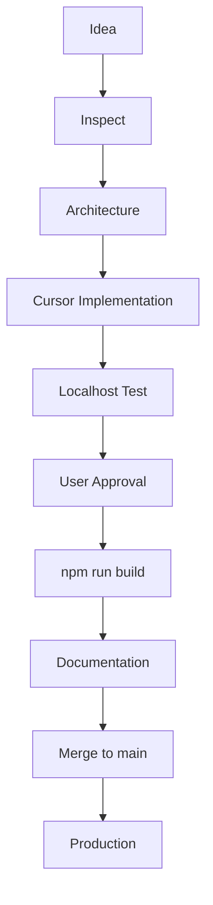

# IMMIFIN Engineering Playbook

## 1. Document Information

| Field | Value |
|-------|-------|
| **Title** | IMMIFIN Engineering Playbook |
| **Purpose** | This document defines how software is planned, implemented, reviewed, tested, documented, and released for the Immifin platform. |
| **Last Updated** | 2026-07-04 |
| **Owner** | Technical Architecture (CTO) |

---

## 2. Engineering Philosophy

Guiding principles for all Immifin engineering work:

- **Build for the long term.** Favor maintainable solutions over quick fixes that create future rework.
- **Simplicity over unnecessary complexity.** Solve the current problem with the smallest correct design.
- **Security by design.** Auth, secrets, and data access are considered at architecture time, not after deployment.
- **Documentation is part of the product.** Undocumented infrastructure and decisions are incomplete work.
- **Automate repetitive work.** Prefer scripts, CI/CD, and repeatable deploys over manual dashboard steps.
- **Production stability is more important than development speed.** A delayed release beats a broken `immifin.com`.

---

## 3. Team Roles & Responsibilities

| Role | Responsibilities |
|------|------------------|
| **Founder & CEO (Samar)** | Product vision; business priorities; sprint approval; final acceptance; production approval |
| **Technical Architect / CTO (ChatGPT)** | Architecture; sprint planning; technical reviews; security reviews; documentation reviews; release approval; risk management |
| **Senior Software Engineer (Cursor)** | Implement approved work; stay within approved scope; create migrations; refactor code; fix bugs; never exceed task boundaries |

---

## 4. Engineering Workflow

**Development Workflow v2.0** is the official process for all feature work (effective 2026-06-30). See [§8 Git & Development Workflow v2.0](#8-git--development-workflow-v20) for the full rule set.



### Stage descriptions

| Stage | Purpose |
|-------|---------|
| **Idea** | Problem or feature is identified; scope and business value are clarified. |
| **Inspect** | Read relevant code, docs, and prior decisions **before** writing code. |
| **Architecture** | Technical approach, data model, security, and integration points are explained and agreed **before** implementation. |
| **Cursor Implementation** | Approved work is implemented on a **feature branch** within task boundaries. |
| **Localhost Test** | Verify behavior on `http://localhost:3000`; use `dev.immifin.com` when webhooks or auth callbacks are involved. |
| **User Approval** | Founder confirms localhost behavior meets acceptance criteria. |
| **Build gate** | `npm run build` must pass before merge or push to `main`. |
| **Documentation** | Status, decisions, and playbook updates when architecture or workflow changes. |
| **Merge to main** | Feature branch merged after gates pass; `main` triggers production deploy. |
| **Production** | Deployment to `immifin.com` via Cloudflare Workers (OpenNext); verify after deploy. |

---

## 5. Sprint Lifecycle

```
Sprint Planning
        ↓
Inspect & Architecture Review
        ↓
Feature Branch
        ↓
Implementation
        ↓
Localhost Testing
        ↓
User Approval
        ↓
npm run build
        ↓
Documentation Update
        ↓
Merge to main
        ↓
Production Deployment
```

| Phase | Purpose |
|-------|---------|
| **Sprint Planning** | Select backlog items, define scope, and secure sprint approval from the Founder. |
| **Inspect & Architecture Review** | Read existing code and docs; confirm design, migrations, APIs, and security **before** coding. |
| **Feature Branch** | Create a branch from `main` for all feature work; do not develop features directly on `main`. |
| **Implementation** | Build the approved features in Cursor; stay within scope. |
| **Localhost Testing** | Verify acceptance criteria on `http://localhost:3000`; verify tunnel + webhooks when auth/profile sync is in scope. |
| **User Approval** | Founder confirms localhost behavior before commit/merge. |
| **Build gate** | Run `npm run build`; fix failures before merge or push. |
| **Documentation Update** | Update project status, decisions, and architecture docs when applicable. |
| **Merge to main** | Merge the feature branch after all gates pass; obtain production approval when required. |
| **Production Deployment** | Cloudflare runs `npm run deploy` from `main`; verify at `immifin.com`. |

---

## 6. Documentation Standards

Every sprint must update the following documents **when applicable**:

| Document | When to update |
|----------|----------------|
| [PROJECT_STATUS.md](./PROJECT_STATUS.md) | Every sprint — phase, completed work, next steps |
| [SPRINT_BACKLOG.md](./SPRINT_BACKLOG.md) | Every sprint — priorities and backlog state |
| [TECHNICAL_DECISIONS.md](./TECHNICAL_DECISIONS.md) | When architecture or conventions change |
| [PROJECT_DECISIONS.md](./PROJECT_DECISIONS.md) | When engineering or workflow decisions change |
| [SYSTEM_ARCHITECTURE.md](./SYSTEM_ARCHITECTURE.md) | When infrastructure, domains, or deployment changes |
| [DEVELOPER_SETUP.md](./DEVELOPER_SETUP.md) | When local dev, tunnel, or webhook workflow changes |
| [CHANGELOG.md](./CHANGELOG.md) | Per-release change log |
| [RELEASE_NOTES_v0.4.1.md](./RELEASE_NOTES_v0.4.1.md) | v0.4.1 foundation milestone release notes |
| [BUSINESS_MODEL.md](./BUSINESS_MODEL.md) | Subscription tiers and capabilities — source of truth for feature gating |

**Documentation is part of the Definition of Done.** A task is not complete until the relevant docs reflect the change.

---

## 7. Architecture Review Process

Every significant feature requires the following sequence:

1. **Inspect** — Read relevant files, docs, and prior decisions before changing code.
2. **Problem definition** — What are we solving and for whom?
3. **Architecture review** — Explain how it fits the stack (Next.js, Clerk, Supabase, Cloudflare) **before** implementation.
4. **Implementation plan** — Files, migrations, APIs, and test plan.
5. **Implementation** — Code written only after steps 1–4 are approved; work happens on a **feature branch**.
6. **Localhost testing** — Verification on `http://localhost:3000` against acceptance criteria.
7. **User approval** — Founder confirms localhost behavior before commit/merge.
8. **Build gate** — `npm run build` passes before merge or push to `main`.
9. **Documentation** — Status, decisions, and architecture updates when applicable.
10. **Approval** — Technical Architect and Founder sign-off as required before merge to `main`.

**No major feature begins with code. Inspect and explain architecture first.**

---

## 8. Git & Development Workflow v2.0

**Effective:** 2026-06-30  
**Replaces:** direct-to-`main` feature development (temporary practice during early stabilization).

### Official workflow

```
Feature branch (from main)
        ↓
Inspect → Architecture explanation
        ↓
Implementation
        ↓
Localhost test
        ↓
User approval
        ↓
npm run build
        ↓
Commit on feature branch
        ↓
Merge to main
        ↓
Production (auto-deploy from main)
```

Pushing to `main` still triggers production deployment on Cloudflare Workers (OpenNext via `npm run deploy`). Feature work must reach `main` only through the gates below.

### Development Workflow v2.0 — rules

| # | Rule |
|---|------|
| 1 | **Use feature branches** for all new work (`feature/<short-description>` or equivalent). |
| 2 | **Do not work directly on `main`** for feature development. `main` is for merged, gated work only. |
| 3 | **Inspect before coding** — read relevant code, docs, and decisions before making changes. |
| 4 | **Explain architecture before implementation** — agree on approach before writing code. |
| 5 | **Test localhost before commit** — verify on `http://localhost:3000`. |
| 6 | **User approval required** after localhost verification and before merge/push to `main`. |
| 7 | **`npm run build` must pass** before merge or push to `main`. |
| 8 | **Never combine infrastructure and feature work** in the same branch or session when avoidable. |
| 9 | **Keep the repository clean** before ending a session (no stray uncommitted work without intent; resolve or stash deliberately). |
| 10 | **Update docs** when architecture or workflow changes (`PROJECT_STATUS.md`, `PROJECT_DECISIONS.md`, `ENGINEERING_PLAYBOOK.md`, etc.). |

### Step-by-step (release path)

1. Create a feature branch from `main`
2. Inspect existing code and docs
3. Explain architecture and get approval
4. Implement on the feature branch
5. Test on localhost (`npm run dev` or `npm run dev:local` when Clerk webhooks are needed)
6. Obtain user approval after localhost verification
7. Run `npm run build` and fix any failures
8. Commit on the feature branch with a descriptive message
9. Update applicable documentation
10. Merge to `main` (after approval)
11. Cloudflare automatically deploys
12. Verify production at `immifin.com`

Optional: test `dev.immifin.com` before merging when tunnel access is available (`npm run dev:local`).

See [DEVELOPER_SETUP.md](./DEVELOPER_SETUP.md) for local dev and tunnel setup.

See [DEPLOYMENT.md](./DEPLOYMENT.md) for build commands and secrets management.

### Emergency / hotfix exception

Critical production fixes may use a short-lived `hotfix/<description>` branch with the same localhost → approval → build gates. Do not skip user approval or `npm run build` unless the Founder explicitly approves an emergency exception and documents it in `PROJECT_DECISIONS.md`.

---

## 9. Release Gates

A release must satisfy **all gates** before merge to `main` and production deploy:

| Gate | Requirement |
|------|-------------|
| **1. Inspected & architecture explained** | Relevant code reviewed; approach agreed before implementation |
| **2. Architecture approved** | Design reviewed for stack fit, security, and scope |
| **3. Localhost tested** | Behavior verified on `http://localhost:3000` |
| **3b. Tunnel & webhooks verified** | When auth/webhook/profile code changed: `dev.immifin.com` healthy; Clerk webhook deliveries return **200** |
| **4. User approved** | Founder confirms localhost meets acceptance criteria |
| **5. Build passed** | `npm run build` succeeds with no errors |
| **6. Documentation updated** | Applicable docs reflect the change |
| **7. Production approved** | Founder grants production release approval when required |

See [DEVELOPER_SETUP.md § Release checklist](./DEVELOPER_SETUP.md#release-checklist) for the full pre-push smoke test list.

---

## 10. Engineering Rules

- **Use feature branches** for new work; do not develop features directly on `main`.
- **Inspect before coding**; explain architecture before implementation.
- **Never commit without localhost verification** and user approval when merging to `main`.
- **Never push or merge to `main` without a passing `npm run build`.**
- **Never combine infrastructure and feature work** in the same branch when avoidable.
- **Never commit immediately after coding** without review, testing, documentation, and release gates.
- **Never skip documentation.** Update applicable docs as part of Definition of Done.
- **Never commit secrets.** No `.env.local`, API keys, or credentials in git.
- **Keep the repository clean** before ending a session.
- **Infrastructure changes require `SYSTEM_ARCHITECTURE.md` updates.**
- **Architectural decisions require `TECHNICAL_DECISIONS.md` and/or `PROJECT_DECISIONS.md` updates.**
- **Workflow changes require `ENGINEERING_PLAYBOOK.md` and/or `DEVELOPER_SETUP.md` updates.**
- **Sprint completion requires `PROJECT_STATUS.md` updates.**
- **Debugging infrastructure longer than 15 minutes** requires updating `SYSTEM_ARCHITECTURE.md` with findings before continuing.

### Mandatory Cloudflare tunnel workflow (auth & webhooks)

When work involves **Clerk, authentication, webhooks, user lifecycle, profile synchronization, email OTP, or contact onboarding**, the developer **must**:

1. Start the Cloudflare development tunnel (`npm run dev:local` or `cloudflared tunnel run immifin-dev`).
2. Verify the tunnel is healthy before testing (`cloudflared tunnel info immifin-dev`; `https://dev.immifin.com` loads).
3. Verify Clerk webhook delivery (**200** in Dashboard → Webhooks → Message Attempts) before concluding there is an application code bug.

If Clerk webhooks return **530 / 1033**, the tunnel is offline — not an application defect.

Implementation instructions from the Technical Architect (ChatGPT) for the above areas **must** include this reminder. This is mandatory for IMMIFIN.

---

## 11. Decision Making Principles

- **Measure before optimizing.** Profile and observe before changing architecture for performance.
- **Prefer evidence over assumptions.** Use logs, builds, and production checks over guesses.
- **Minimize technical debt.** Pay down debt when touching related code; avoid new shortcuts without a plan.
- **Build reusable components.** Extend existing libs and patterns in `lib/` and `components/`.
- **Prefer configuration over duplication.** Use env vars and shared config files instead of hardcoded copies.
- **Keep business logic centralized.** SQL RPCs, auth helpers, and domain logic live in defined layers — not scattered in UI.
- **Make small, incremental changes.** Prefer focused PRs and commits over large unreviewable diffs.

---

## 12. Never Do Again

Hard-won rules from the 2026-06-27 infrastructure and Visa Bulletin work:

- **Do not convert large Server Components into Client Components.**
- **Do not mix server-side data fetching and client UI state in the same module.**
- **Do not hardcode production secrets into source code.**
- **Do not modify deployment configuration while simultaneously changing application features.**
- **Always verify localhost before pushing.**
- **Always verify dev.immifin.com (tunnel healthy) before webhook or auth testing — and before production when those areas changed.**
- **Always verify production immediately after Cloudflare deployment.**
- **Use the Movement Tracker architecture as the reference implementation** for future interactive Visa Bulletin features.

---

## 13. Lessons Learned (2026-06-27)

### Server vs Client Components

- **Do not convert large Server Components into Client Components** for small interactive UI (e.g. a toggle). This caused webpack / RSC manifest errors on Windows dev and destabilized localhost.
- **Do not mix server data-fetching and client UI in the same module.** Example: `lib/visaBulletinData.ts` contains both `getVisaBulletinData()` (server fetch with `next.revalidate`) and display formatters. Client imports of that module pull server-only code into the client bundle.

### Preferred patterns

| Pattern | When to use |
|---------|-------------|
| **Small Client Component** | Toggle, button state, local UI interactivity — parent stays a Server Component |
| **Movement Tracker architecture** | Client shell + SWR + API route — reference for Visa Bulletin Dashboard enhancement |
| **Clear `.next` + restart dev** | After any Server ↔ Client boundary change on Windows |

---

## 14. Lessons Learned (2026-07-01) — Tunnel offline vs application bug

### Clerk `user.deleted` appeared to fail

**Reported:** Deleting a user in Clerk did not set `profiles.status = 'deleted'` in Supabase.

**Assumed cause:** Webhook handler or `soft_delete_profile_by_clerk_id` RPC defect.

**Actual cause:** Cloudflare development tunnel was **offline**. Clerk could not POST to `https://dev.immifin.com/api/webhooks/clerk`.

**Symptom:** Cloudflare HTTP **530**, Error **1033**.

**Resolution:** Start tunnel (`npm run dev:local`); confirm Clerk Message Attempts return **200**; then re-test or replay webhook.

**Rule:** Verify infrastructure before debugging application logic. Documented in [DEVELOPER_SETUP.md § Lessons learned](./DEVELOPER_SETUP.md#lessons-learned).

---

## 15. Long-Term Engineering Goals

- [ ] Preview deployments (per feature branch)
- [ ] CI/CD (automated `npm run build` on PR)
- [ ] Automated testing
- [ ] Monitoring
- [ ] Performance dashboards
- [ ] Security audits
- [ ] Infrastructure automation
- [ ] Code coverage
- [ ] Release tagging
- [ ] Observability

---

## 17. v0.4.1 Foundation Milestone

**Sprint 4 (S4-005)** completes the IMMIFIN platform foundation at **v0.4.1**. This is the stable baseline before **Design System 2.0**.

### What v0.4.1 establishes

| Area | Location / pattern |
|------|-------------------|
| **Subscription tiers** | `lib/subscription/tiers.ts` |
| **Capability authorization** | `lib/subscription/capabilities.ts` — always use `hasCapability` / `canAccess*` |
| **My Immifin workspace** | Top nav dropdown; `/dashboard`, `/user-profile` |
| **Premium Feature Discovery** | `components/common/PremiumFeaturePreview.tsx` |
| **Embedded profile gates** | `ProFeatureGate`, `ProFeatureLockedState` |
| **Dev tier testing** | `?devTier=`, DevTierSwitcher — development only |
| **Business source of truth** | [BUSINESS_MODEL.md](./BUSINESS_MODEL.md) |

See [RELEASE_NOTES_v0.4.1.md](./RELEASE_NOTES_v0.4.1.md) and [CURRENT_PROJECT_STATE.md](./CURRENT_PROJECT_STATE.md).

### Implementing new premium features

1. Add capability to `lib/subscription/capabilities.ts` and [BUSINESS_MODEL.md §12](./BUSINESS_MODEL.md#12-subscription-capability-architecture).
2. Define feature-specific benefit group and `infoState` copy in the page.
3. Wrap the real page with `PremiumFeaturePreview` — **never** build duplicate preview layouts or screenshots.
4. For embedded sections (profile tabs), use `ProFeatureGate`.
5. All upgrade CTAs point to `/pricing`.

### Documentation-first rule (v0.4.1+)

Architecture, subscription, and UX decisions are documented **before or alongside** implementation. [BUSINESS_MODEL.md](./BUSINESS_MODEL.md) is the source of truth for feature gating. Product principles in [PRODUCT_VISION.md §21](./PRODUCT_VISION.md#21-product-principles-v041) govern premium UX.

---

## 18. Revision History

| Version | Date | Description |
|---------|------|-------------|
| v1.0 | 2026-06-23 | Initial Engineering Playbook created. |
| v1.1 | 2026-06-27 | OpenNext deployment workflow, lessons learned, CHANGELOG reference. |
| v1.2 | 2026-06-27 | Never Do Again section; official deployment workflow finalized. |
| v2.0 | 2026-06-30 | **Development Workflow v2.0** — feature branches, inspect-first, localhost + user approval, build gate, no infra/feature mixing, clean repo policy. |
| v2.1 | 2026-07-01 | Mandatory Cloudflare tunnel + Clerk webhook workflow; release gate 3b; tunnel-offline incident documented; [DEVELOPER_SETUP.md](./DEVELOPER_SETUP.md) expanded. |
| v2.2 | 2026-07-04 | v0.4.1 foundation milestone; Premium Feature Discovery implementation guide; documentation-first rule (S4-005.15). |

---

## Related documentation

| Document | Contents |
|----------|----------|
| [DEVELOPER_SETUP.md](./DEVELOPER_SETUP.md) | Local dev, tunnel, webhooks, release checklist |
| [DEPLOYMENT.md](./DEPLOYMENT.md) | Build commands and Cloudflare configuration |
| [SYSTEM_ARCHITECTURE.md](./SYSTEM_ARCHITECTURE.md) | Infrastructure and deployment |
| [PROJECT_STATUS.md](./PROJECT_STATUS.md) | Current phase and sprint |
| [SPRINT_BACKLOG.md](./SPRINT_BACKLOG.md) | Backlog and priorities |
| [TECHNICAL_DECISIONS.md](./TECHNICAL_DECISIONS.md) | Architecture decisions |
| [PRODUCT_VISION.md](./PRODUCT_VISION.md) | Product vision and Design System 2.0 scope |
| [RELEASE_NOTES_v0.4.1.md](./RELEASE_NOTES_v0.4.1.md) | v0.4.1 foundation release notes |
