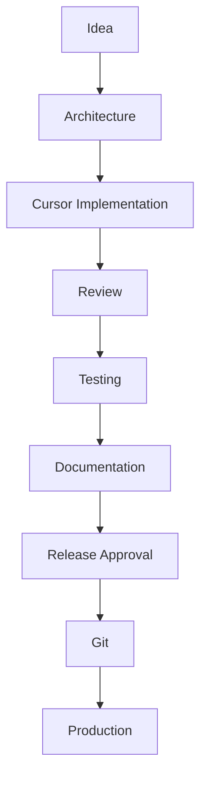

# IMMIFIN Engineering Playbook

## 1. Document Information

| Field | Value |
|-------|-------|
| **Title** | IMMIFIN Engineering Playbook |
| **Purpose** | This document defines how software is planned, implemented, reviewed, tested, documented, and released for the Immifin platform. |
| **Last Updated** | 2026-06-23 |
| **Owner** | Technical Architecture (CTO) |

---

## 2. Engineering Philosophy

Guiding principles for all Immifin engineering work:

- **Build for the long term.** Favor maintainable solutions over quick fixes that create future rework.
- **Simplicity over unnecessary complexity.** Solve the current problem with the smallest correct design.
- **Security by design.** Auth, secrets, and data access are considered at architecture time, not after deployment.
- **Documentation is part of the product.** Undocumented infrastructure and decisions are incomplete work.
- **Automate repetitive work.** Prefer scripts, CI/CD, and repeatable deploys over manual dashboard steps.
- **Production stability is more important than development speed.** A delayed release beats a broken `immifin.com`.

---

## 3. Team Roles & Responsibilities

| Role | Responsibilities |
|------|------------------|
| **Founder & CEO (Samar)** | Product vision; business priorities; sprint approval; final acceptance; production approval |
| **Technical Architect / CTO (ChatGPT)** | Architecture; sprint planning; technical reviews; security reviews; documentation reviews; release approval; risk management |
| **Senior Software Engineer (Cursor)** | Implement approved work; stay within approved scope; create migrations; refactor code; fix bugs; never exceed task boundaries |

---

## 4. Engineering Workflow



### Stage descriptions

| Stage | Purpose |
|-------|---------|
| **Idea** | Problem or feature is identified; scope and business value are clarified. |
| **Architecture** | Technical approach, data model, security, and integration points are defined before coding. |
| **Cursor Implementation** | Approved work is implemented in the repository within task boundaries. |
| **Review** | Code, architecture adherence, and security are checked by the Technical Architect. |
| **Testing** | Manual and/or automated verification that the change works as intended. |
| **Documentation** | Status, decisions, and infrastructure docs are updated as applicable. |
| **Release Approval** | Founder and CTO confirm the change is ready for production. |
| **Git** | Changes are committed and pushed with a descriptive message. |
| **Production** | Deployment to `immifin.com` via Cloudflare Pages (from `main`). |

---

## 5. Sprint Lifecycle

```
Sprint Planning
        ↓
Architecture Review
        ↓
Implementation
        ↓
Testing
        ↓
Documentation Update
        ↓
Release Review
        ↓
Git Commit
        ↓
Git Push
        ↓
Production Deployment
```

| Phase | Purpose |
|-------|---------|
| **Sprint Planning** | Select backlog items, define scope, and secure sprint approval from the Founder. |
| **Architecture Review** | Confirm design, migrations, APIs, and security before implementation starts. |
| **Implementation** | Build the approved features in Cursor; stay within scope. |
| **Testing** | Verify acceptance criteria; test auth, APIs, and critical user paths. |
| **Documentation Update** | Update project status, backlog, decisions, and architecture docs as needed. |
| **Release Review** | Run release gates; obtain production approval. |
| **Git Commit** | Commit with a message describing the feature delivered. |
| **Git Push** | Push to GitHub; `main` triggers production deploy today. |
| **Production Deployment** | Cloudflare Pages builds and serves the release at `immifin.com`. |

---

## 6. Documentation Standards

Every sprint must update the following documents **when applicable**:

| Document | When to update |
|----------|----------------|
| [PROJECT_STATUS.md](./PROJECT_STATUS.md) | Every sprint — phase, completed work, next steps |
| [SPRINT_BACKLOG.md](./SPRINT_BACKLOG.md) | Every sprint — priorities and backlog state |
| [TECHNICAL_DECISIONS.md](./TECHNICAL_DECISIONS.md) | When architecture or conventions change |
| [SYSTEM_ARCHITECTURE.md](./SYSTEM_ARCHITECTURE.md) | When infrastructure, domains, or deployment changes |
| `CHANGELOG.md` | *Future* — per-release change log |
| `RELEASE_NOTES.md` | *Future* — user-facing release summaries |

**Documentation is part of the Definition of Done.** A task is not complete until the relevant docs reflect the change.

---

## 7. Architecture Review Process

Every significant feature requires the following sequence:

1. **Problem definition** — What are we solving and for whom?
2. **Architecture review** — How does it fit the stack (Next.js, Clerk, Supabase, Cloudflare)?
3. **Implementation plan** — Files, migrations, APIs, and test plan.
4. **Implementation** — Code written only after steps 1–3 are approved.
5. **Testing** — Verification against acceptance criteria.
6. **Documentation** — Status, decisions, and architecture updates.
7. **Approval** — Technical Architect and Founder sign-off as required.

**No major feature begins with code.**

---

## 8. Git Workflow

### Current workflow

```
Feature work
        ↓
Review
        ↓
Commit
        ↓
Push main
```

Pushing to `main` currently triggers production deployment on Cloudflare Pages.

### Future workflow

```
Feature Branch
        ↓
Preview Deployment
        ↓
Testing
        ↓
Merge to main
        ↓
Production
```

Direct production deployments from `main` are **temporary**. They will be replaced by preview deployments and branch-based testing to reduce production risk.

---

## 9. Release Gates

A release must satisfy **all five gates** before deployment:

| Gate | Requirement |
|------|-------------|
| **1. Architecture Approved** | Design reviewed and agreed before or during implementation |
| **2. Code Reviewed** | Implementation checked for scope, quality, and security |
| **3. Testing Passed** | Manual and/or automated tests confirm expected behavior |
| **4. Documentation Updated** | Applicable docs reflect the change |
| **5. Production Approved** | Founder grants production release approval |

---

## 10. Engineering Rules

- **Never commit immediately after coding.** Complete review, testing, documentation, and release approval first.
- **Never skip documentation.** Update applicable docs as part of Definition of Done.
- **Never commit secrets.** No `.env.local`, API keys, or credentials in git.
- **Infrastructure changes require `SYSTEM_ARCHITECTURE.md` updates.**
- **Architectural decisions require `TECHNICAL_DECISIONS.md` updates.**
- **Sprint completion requires `PROJECT_STATUS.md` updates.**
- **Debugging infrastructure longer than 15 minutes** requires updating `SYSTEM_ARCHITECTURE.md` with findings before continuing.

---

## 11. Decision Making Principles

- **Measure before optimizing.** Profile and observe before changing architecture for performance.
- **Prefer evidence over assumptions.** Use logs, builds, and production checks over guesses.
- **Minimize technical debt.** Pay down debt when touching related code; avoid new shortcuts without a plan.
- **Build reusable components.** Extend existing libs and patterns in `lib/` and `components/`.
- **Prefer configuration over duplication.** Use env vars and shared config files instead of hardcoded copies.
- **Keep business logic centralized.** SQL RPCs, auth helpers, and domain logic live in defined layers — not scattered in UI.
- **Make small, incremental changes.** Prefer focused PRs and commits over large unreviewable diffs.

---

## 12. Long-Term Engineering Goals

- [ ] Preview deployments
- [ ] CI/CD
- [ ] Automated testing
- [ ] Monitoring
- [ ] Performance dashboards
- [ ] Security audits
- [ ] Infrastructure automation
- [ ] Code coverage
- [ ] Release tagging
- [ ] Observability

---

## 13. Revision History

| Version | Date | Description |
|---------|------|-------------|
| v1.0 | 2026-06-23 | Initial Engineering Playbook created. |

---

## Related documentation

| Document | Contents |
|----------|----------|
| [SYSTEM_ARCHITECTURE.md](./SYSTEM_ARCHITECTURE.md) | Infrastructure and deployment |
| [PROJECT_STATUS.md](./PROJECT_STATUS.md) | Current phase and sprint |
| [SPRINT_BACKLOG.md](./SPRINT_BACKLOG.md) | Backlog and priorities |
| [TECHNICAL_DECISIONS.md](./TECHNICAL_DECISIONS.md) | Architecture decisions |
| [PRODUCT_ROADMAP.md](./PRODUCT_ROADMAP.md) | Product phases |
