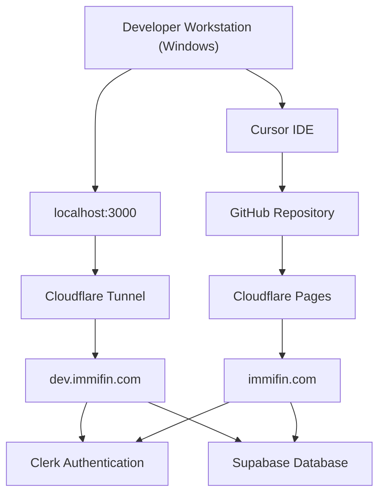
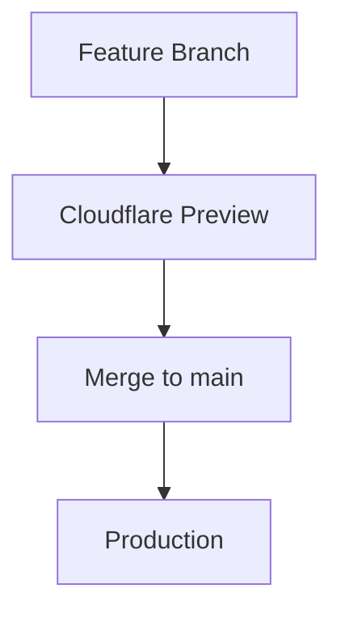

# IMMIFIN System Architecture

## 1. Document Information

| Field | Value |
|-------|-------|
| **Title** | IMMIFIN System Architecture |
| **Purpose** | This document describes the complete infrastructure architecture of the Immifin platform. |
| **Last Updated** | 2026-06-23 |
| **Owner** | Technical Architecture (CTO) |

This document is the **single source of truth** for Immifin's infrastructure, environments, deployment flow, networking, external services, and operational architecture.

It documents:

- Development environment
- Preview environment
- Production environment
- Deployment flow
- External services
- Environment variables
- Networking
- Disaster recovery

---

## 2. Source of Truth

This document is the **authoritative infrastructure reference** for the Immifin platform.

When any of the following change, this file must be updated **before or as part of** the change:

- Domains or DNS (`immifin.com`, `dev.immifin.com`)
- Cloudflare Pages, Workers, or Tunnel configuration
- Deployment flow or branch strategy
- External service accounts (Clerk, Supabase, GitHub)
- Environment variable names or where they are stored
- Disaster recovery procedures

If infrastructure debugging exceeds 15 minutes, pause and update this document with findings (see [ENGINEERING_PLAYBOOK.md](./ENGINEERING_PLAYBOOK.md)). Other docs (e.g. `TECHNICAL_DECISIONS.md`) record application architecture; **this document owns infrastructure**.

---

## 3. Architecture Principles

| Principle | Meaning |
|-----------|---------|
| **Local is isolated from Production** | `localhost:3000` and `.env.local` never share production secrets or data by default. |
| **Development never impacts Production** | The Cloudflare Tunnel and local dev server do not deploy to `immifin.com`. |
| **Production requires review** | Changes reaching `main` should pass release gates before they affect live users. |
| **Secrets never go into Git** | API keys, service role keys, and webhook secrets live in `.env.local` or the Cloudflare dashboard only. |
| **Infrastructure changes require documentation** | Update this file when hosting, domains, tunnels, or env strategy changes. |
| **Prefer automation** | Favor CI/CD, preview deploys, and repeatable builds over manual dashboard steps. |
| **Separate Development, Preview, and Production** | Use distinct URLs, credentials, and Supabase/Clerk instances per environment as the platform matures. |

---

## 4. High-Level Architecture



### Component overview

| Component | Purpose |
|-----------|---------|
| **Developer Workstation (Windows)** | Local machine where Immifin is built, tested, and run via `npm run dev` |
| **Cursor IDE** | Primary development environment for implementing approved work |
| **GitHub Repository** | Source control; `main` branch triggers production deployment |
| **Cloudflare Pages** | Hosted production platform for the Next.js application |
| **Cloudflare Tunnel** | Secure outbound tunnel exposing local dev server over HTTPS |
| **localhost:3000** | Local Next.js development server (`npm run dev`) |
| **dev.immifin.com** | Public HTTPS URL routed through the tunnel to localhost |
| **immifin.com** | Production domain served by Cloudflare Pages |
| **Clerk Authentication** | Identity provider — signup, login, sessions, webhooks |
| **Supabase Database** | Application Postgres — profiles, subscriptions, audit data |

---

## 5. Environments

| Environment | Purpose | URL | Deployment Method | Status |
|-------------|---------|-----|-------------------|--------|
| **Local Development** | Day-to-day coding and local testing | `http://localhost:3000` | `npm run dev` | Active |
| **Development (Tunnel)** | HTTPS dev access, Clerk webhooks, shared testing | `https://dev.immifin.com` | Cloudflare Tunnel | Active |
| **Production** | Public live site | `https://immifin.com` | Cloudflare Pages | Active |
| **Preview** | Branch-based pre-production testing | *Planned* | Cloudflare Preview | Planned |

---

## 6. Development Environment

| Setting | Value |
|---------|-------|
| **Operating System** | Windows |
| **IDE** | Cursor |
| **Framework** | Next.js 15 |
| **Package Manager** | npm |
| **Development Server** | `npm run dev` |
| **Configuration File** | `.env.local` |

### Purpose of `.env.local`

Stores local development secrets and environment variables. This file is **gitignored** and must never be committed. Copy variable names from `.env.example` when setting up a new workstation.

---

## 7. Cloudflare Tunnel

| Setting | Value |
|---------|-------|
| **Tunnel Name** | `immifin-dev` |
| **Purpose** | Expose localhost securely during development |
| **Public URL** | `https://dev.immifin.com` |
| **Authentication** | `cloudflared tunnel login` |
| **Certificate Location** | `C:\Users\Admin\.cloudflared\cert.pem` |

### Useful Commands

```bash
cloudflared tunnel list
cloudflared tunnel info immifin-dev
cloudflared tunnel run immifin-dev
```

### Important constraint

The Cloudflare Tunnel is intended **only for development access**. It routes `dev.immifin.com` to `http://localhost:3000` on the developer workstation. It must **not** be used as the production deployment mechanism. Production is served exclusively through **Cloudflare Pages**.

Both `npm run dev` and `cloudflared tunnel run immifin-dev` must be running for `dev.immifin.com` to respond.

---

## 8. Production Deployment

| Setting | Value |
|---------|-------|
| **Current production domain** | `https://immifin.com` |
| **Deployment source** | GitHub `main` branch |
| **Hosting platform** | Cloudflare Pages |

### Current observation

Production currently auto-deploys from the `main` branch. Every push to `main` can trigger a live deployment. This will be improved in a future sprint with preview deployments and release gates before production promotion.

Production environment variables are configured in the **Cloudflare Dashboard**, not in the repository.

---

## 9. External Services

| Service | Purpose | Current Role | Status |
|---------|---------|--------------|--------|
| **GitHub** | Source control and deploy trigger | Hosts `adminjodiba/immifin`; push to `main` deploys production | Active |
| **Cloudflare Pages** | Production hosting | Builds and serves `immifin.com` | Active |
| **Cloudflare Tunnel** | Dev HTTPS access | Routes `dev.immifin.com` → localhost | Active |
| **Clerk** | Authentication and identity | Signup, login, sessions, webhook sync to Supabase | Active |
| **Supabase** | Application database | Profiles, immigration data, subscriptions, audit log | Active |

---

## 10. Environment Variables

**Production secrets must never be committed to Git.**

### Local Development (`.env.local`)

List variable names only. Do not store values in this document.

| Variable |
|----------|
| `NEXT_PUBLIC_CLERK_PUBLISHABLE_KEY` |
| `CLERK_SECRET_KEY` |
| `CLERK_WEBHOOK_SECRET` |
| `NEXT_PUBLIC_SUPABASE_URL` |
| `SUPABASE_SERVICE_ROLE_KEY` |
| `NEXT_PUBLIC_CLERK_SIGN_IN_URL` |
| `NEXT_PUBLIC_CLERK_SIGN_UP_URL` |
| `GOOGLE_SERVICE_ACCOUNT_KEY` |
| `VISA_BULLETIN_GOOGLE_SHEET_ID` |

Additional optional overrides may be defined in `.env.example` (visa bulletin GIDs, Google Sheets archive fields).

### Cloudflare Preview

Placeholder for future environment variables.

When preview deployments are enabled, configure variables under **Cloudflare Dashboard → Workers & Pages → immifin → Settings → Environment variables → Preview**.

### Cloudflare Production

Placeholder for production environment variables.

Configure under **Cloudflare Dashboard → Workers & Pages → immifin → Settings → Environment variables → Production**.

---

## 11. Deployment Strategy

### Current

```
Developer
        ↓
GitHub main
        ↓
Cloudflare Production
```

### Future (target)

```
Feature Branch
        ↓
Cloudflare Preview
        ↓
Testing
        ↓
Merge to main
        ↓
Production
```

### Target deployment flow



### Why preview deployments reduce production risk

Preview deployments allow each feature branch to run in an isolated hosted environment before merging to `main`. This enables:

- Testing auth, API routes, and data sync without affecting live users
- Catching build failures and missing environment variables before production
- Manual acceptance on a stable URL instead of a developer's local tunnel
- Reducing the blast radius of a bad merge to `main`, which today auto-deploys to `immifin.com`

---

## 12. Disaster Recovery

### GitHub repository recovery

- The GitHub repository is the source of truth for application code.
- Clone from `adminjodiba/immifin` to restore the codebase.
- Database schema is recoverable from `supabase/migrations/`.

### Cloudflare deployment rollback

1. Open **Cloudflare Dashboard → Workers & Pages → immifin → Deployments**.
2. Identify the last known good deployment.
3. Roll back or promote that deployment to restore `immifin.com`.
4. Prefer dashboard rollback over force-push to `main`.

### Tunnel recreation

1. Run `cloudflared tunnel login` on the developer workstation.
2. Verify or recreate tunnel `immifin-dev`.
3. Restore public hostname: `dev.immifin.com` → `http://localhost:3000`.
4. Confirm DNS CNAME points to the tunnel endpoint.

### Clerk recovery

- User identity and credentials are stored in Clerk.
- Re-register webhook endpoint: `https://dev.immifin.com/api/webhooks/clerk` (dev) or `https://immifin.com/api/webhooks/clerk` (prod).
- Application roles live in Supabase `profiles`; restore via webhook sync or manual SQL bootstrap.

### Supabase recovery

- Use Supabase dashboard backups and point-in-time recovery for production data.
- Re-apply migrations from `supabase/migrations/` when rebuilding a project.
- Verify connection strings and service role key after recovery.

### Environment variable restoration

- **Local:** Restore from secure backup or password manager; reference `.env.example` for variable names.
- **Production / Preview:** Re-enter values in Cloudflare Dashboard environment settings.
- **Never** recover secrets from git history — rotate any credential that may have been exposed.

---

## 13. Known Issues

- **Production currently deploys directly from the `main` branch.** There is no mandatory preview gate before live deployment.
- **Preview deployments are planned** but not yet the primary workflow. Development testing currently relies on the Cloudflare Tunnel.
- **Infrastructure documentation was introduced after Sprint 1.** Prior deployment knowledge existed outside the repository.
- **Deployment strategy will evolve** as the platform grows — separate environments, CI/CD, and release tags are on the roadmap.

---

## 14. Future Improvements

- [ ] Separate Development Environment
- [ ] Separate Preview Environment
- [ ] Separate Production Environment
- [ ] Separate Clerk Development Instance
- [ ] Separate Clerk Production Instance
- [ ] Separate Supabase Development Project
- [ ] Separate Supabase Production Project
- [ ] GitHub Actions
- [ ] Automated Testing
- [ ] Monitoring
- [ ] Release Tags
- [ ] Infrastructure Health Checks
- [ ] CI/CD Pipeline

---

## 15. Revision History

| Version | Date | Description |
|---------|------|-------------|
| v0.1 | 2026-06-23 | Initial architecture documentation created after Sprint 1. |
| v1.0 | 2026-06-23 | Revision 1 — Source of Truth, Architecture Principles, target deployment Mermaid diagram. |

---

## Related documentation

| Document | Contents |
|----------|----------|
| [ENGINEERING_PLAYBOOK.md](./ENGINEERING_PLAYBOOK.md) | Engineering workflow and release gates |
| [PROJECT_STATUS.md](./PROJECT_STATUS.md) | Current phase and sprint status |
| [TECHNICAL_DECISIONS.md](./TECHNICAL_DECISIONS.md) | Architecture and coding conventions |
| [auth/PHASE1.md](./auth/PHASE1.md) | Clerk, Supabase, middleware, webhooks |
| [.env.example](../.env.example) | Local environment variable template |
