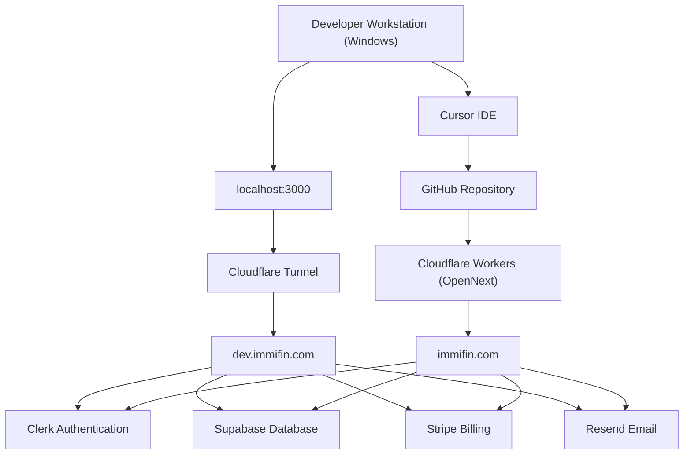
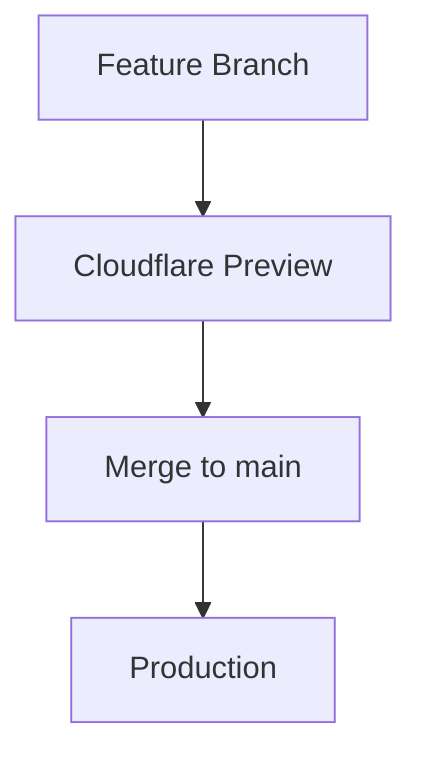

# IMMIFIN System Architecture

## 1. Document Information

| Field | Value |
|-------|-------|
| **Title** | IMMIFIN System Architecture |
| **Purpose** | Authoritative technical architecture for Immifin — infrastructure plus major platform subsystems. |
| **Last Updated** | 2026-07-20 |
| **Owner** | Technical Architecture (CTO) |
| **As-built baseline** | Sprint 7 commercial platform (application code); Live Stripe validation pending |

This document is the **single source of truth** for Immifin's system architecture: infrastructure, environments, deployment, external services, and the major application platforms that sit on top of them.

It documents:

- Development, tunnel, and production environments
- Deployment flow and networking
- External services and environment variables
- Disaster recovery
- Platform layers (auth, profiles, immigration, notifications, Stripe billing, capabilities, presentation)
- Capability and subscription access architecture
- Billing ownership boundaries (IMMIFIN vs Stripe)

Detailed commercial policy and billing ADR live in [BILLING_ARCHITECTURE.md](./BILLING_ARCHITECTURE.md) and [STRIPE_BILLING_POLICY.md](./STRIPE_BILLING_POLICY.md). Sprint as-built status: [SPRINT_7_HANDOFF.md](./SPRINT_7_HANDOFF.md) · [CURRENT_PROJECT_STATE.md](./CURRENT_PROJECT_STATE.md).

---

## 2. Source of Truth

This document is the **authoritative system architecture reference** for the Immifin platform.

When any of the following change, this file must be updated **before or as part of** the change:

- Domains or DNS (`immifin.com`, `dev.immifin.com`)
- Cloudflare Workers / OpenNext, Pages, or Tunnel configuration
- Deployment flow or branch strategy
- External service accounts (Clerk, Supabase, GitHub, Stripe, Resend)
- Environment variable names or where they are stored
- Disaster recovery procedures
- Major platform boundaries (billing ownership, capability enforcement, notification pipeline)

If infrastructure debugging exceeds 15 minutes, pause and update this document with findings (see [ENGINEERING_PLAYBOOK.md](./ENGINEERING_PLAYBOOK.md)). Coding conventions live in [TECHNICAL_DECISIONS.md](./TECHNICAL_DECISIONS.md); **this document owns system architecture**.

---

## 3. Architecture Principles

| Principle | Meaning |
|-----------|---------|
| **Local is isolated from Production** | `localhost:3000` and `.env.local` never share production secrets or data by default. |
| **Development never impacts Production** | The Cloudflare Tunnel and local dev server do not deploy to `immifin.com`. |
| **Production requires review** | Changes reaching `main` should pass release gates before they affect live users. |
| **Secrets never go into Git** | API keys, service role keys, and webhook secrets live in `.env.local` or the Cloudflare dashboard only. |
| **Infrastructure changes require documentation** | Update this file when hosting, domains, tunnels, or env strategy changes. |
| **Prefer automation** | Favor CI/CD, preview deploys, and repeatable builds over manual dashboard steps. |
| **Separate Development, Preview, and Production** | Use distinct URLs, credentials, and Supabase/Clerk instances per environment as the platform matures. |
| **Prefer existing proven architecture** | Reuse working implementations (e.g. Movement Tracker) over introducing new patterns. |
| **Server Components for data** | Keep Server Components responsible for server-side rendering and data loading. |
| **Client Components for interaction** | Keep Client Components responsible only for user interaction (toggles, local state). |
| **Deployment independent from features** | Keep deployment configuration independent from application features. |
| **Separate infra and feature work** | Never mix infrastructure work with feature work in the same sprint unless necessary. |

---

## 4. High-Level Architecture

### 4.1 Infrastructure topology



### 4.2 Platform layers

```text
Presentation Layer (Next.js pages / UI)
        ↓
Capability Enforcement Layer
        ↓
┌───────────────────────────────────────────────┐
│ Authentication (Clerk)                        │
│ User Profile Layer (Supabase profiles)        │
│ Immigration Services (bulletin / calculators) │
│ Notification Platform (Resend)                │
│ Stripe Billing Platform (Checkout / webhooks) │
└───────────────────────────────────────────────┘
        ↓
External Integrations (Clerk · Supabase · Stripe · Resend · Google Sheets · Cloudflare)
```

| Layer | Responsibility |
|-------|----------------|
| **Authentication Layer** | Clerk identity, sessions, webhook sync into application profiles |
| **User Profile Layer** | Account profile, immigration profile, contact preferences, subscription billing fields |
| **Immigration Services** | Visa Bulletin surfaces, calculators, journey-aware dashboards |
| **Notification Platform** | Journey-aware email campaigns via Resend (production validated) |
| **Stripe Billing Platform** | Checkout, customer mapping, webhooks, billing-state sync, Billing Center plan changes |
| **Capability Enforcement Layer** | Tier → capability map; server helpers + premium UI gates |
| **Presentation Layer** | Pricing, Billing Center, My Immifin, marketing/public pages |
| **External Integrations** | Clerk, Supabase, Stripe, Resend, Google Sheets, Cloudflare |

### 4.3 Infrastructure component overview

| Component | Purpose |
|-----------|---------|
| **Developer Workstation (Windows)** | Local machine where Immifin is built, tested, and run via `npm run dev` |
| **Cursor IDE** | Primary development environment for implementing approved work |
| **GitHub Repository** | Source control; `main` branch triggers production deployment |
| **Cloudflare Workers (OpenNext)** | Production hosting via `@opennextjs/cloudflare`; builds from `main` |
| **Cloudflare Tunnel** | Secure outbound tunnel exposing local dev server over HTTPS |
| **localhost:3000** | Local Next.js development server (`npm run dev`) |
| **dev.immifin.com** | Public HTTPS URL routed through the tunnel to localhost |
| **immifin.com** | Production domain served by Cloudflare Workers (OpenNext) |
| **Clerk Authentication** | Identity provider — signup, login, sessions, webhooks |
| **Supabase Database** | Application Postgres — profiles, subscriptions, webhook ledger, audit data |
| **Stripe** | Payments, customers, subscriptions, invoices (money plane) |
| **Resend** | Transactional / campaign email delivery |

---

## 5. Environments

| Environment | Purpose | URL | Deployment Method | Status |
|-------------|---------|-----|-------------------|--------|
| **Local Development** | Day-to-day coding and local testing | `http://localhost:3000` | `npm run dev` | Active |
| **Development (Tunnel)** | HTTPS dev access, Clerk webhooks, shared testing | `https://dev.immifin.com` | Cloudflare Tunnel | Active |
| **Production** | Public live site | `https://immifin.com` | GitHub `main` → OpenNext (`npm run deploy`) | Active |
| **Preview** | Branch-based pre-production testing | *Planned* | Cloudflare Preview | Planned |

---

## 6. Development Environment

| Setting | Value |
|---------|-------|
| **Operating System** | Windows |
| **IDE** | Cursor |
| **Framework** | Next.js 15 |
| **Package Manager** | npm |
| **Development Server** | `npm run dev` |
| **Configuration File** | `.env.local` |

### Purpose of `.env.local`

Stores local development secrets and environment variables. This file is **gitignored** and must never be committed. Copy variable names from `.env.example` when setting up a new workstation.

---

## 7. Cloudflare Tunnel

| Setting | Value |
|---------|-------|
| **Tunnel Name** | `immifin-dev` |
| **Purpose** | Expose localhost securely during development |
| **Public URL** | `https://dev.immifin.com` |
| **Authentication** | `cloudflared tunnel login` |
| **Certificate Location** | `C:\Users\Admin\.cloudflared\cert.pem` |

### Useful Commands

```bash
cloudflared tunnel list
cloudflared tunnel info immifin-dev
cloudflared tunnel run immifin-dev
```

### Important constraint

The Cloudflare Tunnel is intended **only for development access**. It routes `dev.immifin.com` to `http://localhost:3000` on the developer workstation. It must **not** be used as the production deployment mechanism. Production is served exclusively through **Cloudflare Workers (OpenNext)**.

Both `npm run dev` and `cloudflared tunnel run immifin-dev` must be running for `dev.immifin.com` to respond.

---

## 8. Production Deployment

| Setting | Value |
|---------|-------|
| **Current production domain** | `https://immifin.com` |
| **Deployment source** | GitHub `main` branch |
| **Hosting platform** | Cloudflare Workers via OpenNext |
| **Latest production commit** | `5f40203` — Subscription Foundation + Cloudflare build variable rebuild |
| **Production build command** | `npm run deploy` |
| **Production deploy command** | `echo done` |

### OpenNext vs plain Next.js build

| Command | Purpose |
|---------|---------|
| `npm run build` | Next.js only (`next build`) — **not** sufficient for Cloudflare Workers |
| `opennextjs-cloudflare build` | Next.js + Worker bundle (output in `.open-next/`) |
| `npm run deploy` | OpenNext build + deploy to Cloudflare |

Cloudflare’s dashboard runs **`npm run deploy`** as the build command. Deploy is already included in that script, so the separate deploy command is **`echo done`** to avoid double deployment.

### Repository config files

| File | Purpose |
|------|---------|
| `open-next.config.ts` | OpenNext Cloudflare adapter config |
| `wrangler.jsonc` | Worker bindings, compatibility flags, public vars |

Production secrets are configured in the **Cloudflare Dashboard** or via **Wrangler Version Secrets** — never in Git. See [DEPLOYMENT.md](./DEPLOYMENT.md).

---

## 9. External Services

| Service | Purpose | Current Role | Status |
|---------|---------|--------------|--------|
| **GitHub** | Source control and deploy trigger | Hosts `adminjodiba/immifin`; push to `main` deploys production | Active |
| **Cloudflare Workers (OpenNext)** | Production hosting | Builds and serves `immifin.com` via Worker | Active |
| **Cloudflare Tunnel** | Dev HTTPS access | Routes `dev.immifin.com` → localhost | Active |
| **Clerk** | Authentication and identity | Signup, login, sessions, webhook sync to Supabase | Active / Production Validated |
| **Supabase** | Application database | Profiles, immigration data, subscriptions, Stripe webhook ledger | Active / Production Validated |
| **Stripe** | Payments and subscription objects | Checkout, customers, subscriptions, invoices, webhooks | **Implemented in app** — Live validation pending |
| **Resend** | Email delivery | Notification Platform provider | Active / Production Validated |
| **Google Sheets** | Visa Bulletin source | Admin sync / archive source for bulletin datasets | Active |

---

## 10. Environment Variables

**Production secrets must never be committed to Git.**

Manage production secrets with **Wrangler Version Secrets**:

```bash
npx wrangler versions secret put VARIABLE_NAME
```

Do not hardcode secrets in `wrangler.jsonc` or source code.

### Required (Production)

| Variable | Purpose | Secret |
|----------|---------|--------|
| `NEXT_PUBLIC_CLERK_PUBLISHABLE_KEY` | Clerk client key | No |
| `CLERK_SECRET_KEY` | Clerk server key | Yes |
| `CLERK_WEBHOOK_SECRET` | Webhook verification | Yes |
| `NEXT_PUBLIC_SUPABASE_URL` | Supabase project URL | No |
| `SUPABASE_SERVICE_ROLE_KEY` | Supabase service role | Yes |
| `GOOGLE_SHEET_ID` | Google Spreadsheet ID (admin archive) | No |
| `GOOGLE_CLIENT_EMAIL` | Service account email | Semi-secret |
| `GOOGLE_PRIVATE_KEY` | Service account private key | Yes |

### Stripe (required for commercial Checkout / webhooks)

| Variable | Purpose | Secret |
|----------|---------|--------|
| `STRIPE_SECRET_KEY` | Stripe server SDK | Yes |
| `NEXT_PUBLIC_STRIPE_PUBLISHABLE_KEY` | Stripe client publishable key | No |
| `STRIPE_WEBHOOK_SECRET` | Webhook signature verification | Yes |
| `STRIPE_PRICE_PRO_MONTHLY` / `_ANNUAL` | Approved Pro Price IDs | Semi-secret |
| `STRIPE_PRICE_POWER_MONTHLY` / `_ANNUAL` | Approved Power Price IDs | Semi-secret |

Operational setup: [STRIPE_OPERATIONS.md](./STRIPE_OPERATIONS.md). Live secrets and webhook registration are **pending validation** for production cutover.

### Optional

| Variable | Purpose | Default |
|----------|---------|---------|
| `NEXT_PUBLIC_CLERK_SIGN_IN_URL` | Clerk sign-in path | `/login` |
| `NEXT_PUBLIC_CLERK_SIGN_UP_URL` | Clerk sign-up path | `/signup` |
| `NEXT_PUBLIC_DEV_SUBSCRIPTION_MODE` | Dev/beta tier override without Live Stripe | Off in Live cutover |
| `RESEND_API_KEY` / `RESEND_FROM_*` | Notification Platform email | — |
| `VISA_BULLETIN_PUBLISH_BASE` | CSV publish URL override | In `lib/visaBulletinConfig.ts` |
| `VISA_BULLETIN_GID_*` | Sheet tab GID overrides | In `lib/visaBulletinConfig.ts` |
| `VISA_BULLETIN_HISTORY_SHEET` | Archive tab name | `VisaBulletinHistory` |

Public Clerk URL defaults are also set in `wrangler.jsonc` under `vars`.

### Local Development (`.env.local`)

Copy from `.env.example`. Gitignored. Used by `npm run dev`.

### Local Workers preview (`.dev.vars`)

Gitignored. Used by `npm run preview` with Wrangler.

---

## 11. Deployment Strategy

### Current (2026-06-27)

```
Developer
        ↓
localhost:3000 (npm run dev)
        ↓ optional
dev.immifin.com (Cloudflare Tunnel)
        ↓
git add → commit → push main
        ↓
Cloudflare Workers (npm run deploy / OpenNext)
        ↓
immifin.com
```

### Future (target)

```
Feature Branch
        ↓
Cloudflare Preview
        ↓
Testing
        ↓
Merge to main
        ↓
Production
```

### Target deployment flow



### Why preview deployments reduce production risk

Preview deployments allow each feature branch to run in an isolated hosted environment before merging to `main`. This enables:

- Testing auth, API routes, and data sync without affecting live users
- Catching build failures and missing environment variables before production
- Manual acceptance on a stable URL instead of a developer's local tunnel
- Reducing the blast radius of a bad merge to `main`, which today auto-deploys to `immifin.com`

---

## 12. Disaster Recovery

### GitHub repository recovery

- The GitHub repository is the source of truth for application code.
- Clone from `adminjodiba/immifin` to restore the codebase.
- Database schema is recoverable from `supabase/migrations/`.

### Cloudflare deployment rollback

1. Open **Cloudflare Dashboard → Workers & Pages → immifin → Deployments**.
2. Identify the last known good deployment.
3. Roll back or promote that deployment to restore `immifin.com`.
4. Prefer dashboard rollback over force-push to `main`.

### Tunnel recreation

1. Run `cloudflared tunnel login` on the developer workstation.
2. Verify or recreate tunnel `immifin-dev`.
3. Restore public hostname: `dev.immifin.com` → `http://localhost:3000`.
4. Confirm DNS CNAME points to the tunnel endpoint.

### Clerk recovery

- User identity and credentials are stored in Clerk.
- Re-register webhook endpoint: `https://dev.immifin.com/api/webhooks/clerk` (dev) or `https://immifin.com/api/webhooks/clerk` (prod).
- Application roles live in Supabase `profiles`; restore via webhook sync or manual SQL bootstrap.

### Supabase recovery

- Use Supabase dashboard backups and point-in-time recovery for production data.
- Re-apply migrations from `supabase/migrations/` when rebuilding a project (includes Stripe webhook foundation migration when rebuilding commercial env).
- Verify connection strings and service role key after recovery.

### Stripe recovery

- Payment objects remain in Stripe; IMMIFIN recovers by re-registering the webhook endpoint and re-syncing subscription billing state into Supabase.
- Rotate `STRIPE_WEBHOOK_SECRET` and Price catalog env vars if compromised.
- Do **not** grant entitlements from browser redirects — wait for durable webhook sync.

### Environment variable restoration

- **Local:** Restore from secure backup or password manager; reference `.env.example` for variable names.
- **Production / Preview:** Re-enter values in Cloudflare Dashboard environment settings.
- **Never** recover secrets from git history — rotate any credential that may have been exposed.

---

## 13. Known Issues

- **Preview deployments are planned** but not yet the primary workflow. Development testing currently relies on the Cloudflare Tunnel.
- **Live Stripe / production commercial cutover** is not validated — see §18.
- **Customer Portal** (payment method / invoices) is not implemented; Billing Center owns plan changes.
- **Do not convert large Server Components to Client Components** for small UI changes — use small client children (see Movement Tracker pattern). Mixing server fetch code and client UI in one module caused dev instability.

---

## 14. Capability Architecture

Product feature access is **capability-based**, not plan-name or raw Stripe-status checks in UI.

### Model

| Concern | Role |
|---------|------|
| **Tiers** | `free` / `pro` / `power` (future Business/Enterprise reserved) |
| **Capability map** | Tier → capabilities; shared helpers for access questions |
| **Effective tier** | Resolved from subscription billing state (+ Development Subscription Mode overlays where enabled) |
| **Server enforcement** | Capability helpers on selected APIs (`assertCapability` / `requireCapability`) |
| **UI gating** | Premium Feature Discovery, dashboard gates, premium nav preview |

Billing-state sync updates the subscription/plan fields that feed the effective tier. **Webhooks synchronize billing state; they do not become ad-hoc feature checks** scattered through components.

See [BUSINESS_MODEL.md §12](./BUSINESS_MODEL.md#12-subscription-capability-architecture).

### Authorization surfaces

| Surface | Role |
|---------|------|
| Capability helpers | Server-side authorization for protected account APIs |
| Premium Feature Discovery | Free-user preview of premium pages with upgrade path |
| Dashboard access gates | Journey/dashboard surfaces respect effective capabilities |
| Premium nav preview | Locked Pro navigation opens a preview instead of a dead end |

**Premium Feature Discovery** remains the standard Free-user UX for premium pages. See [BUSINESS_MODEL.md §15](./BUSINESS_MODEL.md#15-premium-feature-discovery).

### Subscription access path

```
User
  ↓
Pricing / Billing Center / Dev Subscription Mode (non-Live)
  ↓
Subscription billing state (Supabase)
  ↓
Effective tier → capability map
  ↓
Server helpers + UI gates
  ↓
Application features
```

### Tiers

| Tier | Role |
|------|------|
| **Free** | Manual tools, public dashboards, basic calculators |
| **Pro** | Personalization, automation, saved profile, Visa Bulletin History, Movement Tracker, email alerts |
| **Power** | Everything in Pro + AI, multiple profiles, advanced intelligence |

**Source of truth:** [BUSINESS_MODEL.md](./BUSINESS_MODEL.md)

### Development Subscription Mode

Temporary entitlement override for engineering/QA until Live Stripe cutover. Gated by `NEXT_PUBLIC_DEV_SUBSCRIPTION_MODE`.

- Remains available until an explicit production gate turns it off.
- Must be hard-off when Live billing is activated.
- Does not replace webhook-authoritative billing state for real payments.

See [architecture/ADR-007-Development-Subscription-Mode.md](./architecture/ADR-007-Development-Subscription-Mode.md).

---

## 15. Stripe Billing Architecture

**Golden rule:** Stripe manages money. IMMIFIN manages business policy.

Detailed ADR: [BILLING_ARCHITECTURE.md](./BILLING_ARCHITECTURE.md). As-built sprint record: [SPRINT_7_HANDOFF.md](./SPRINT_7_HANDOFF.md).

### Ownership

| Owner | Responsibilities |
|-------|------------------|
| **IMMIFIN** | Business rules, capabilities, authorization, subscription policy (upgrade / downgrade / interval / cancel-to-free), Pricing UX, Billing Center plan orchestration |
| **Stripe** | Payments, Checkout payment collection, invoices, billing objects, customer records, payment methods, webhook delivery |

Customer Portal sessions for payment method / invoices are **not implemented**. Plan changes are owned by the IMMIFIN Billing Center.

### Implemented components

| Component | Responsibility |
|-----------|----------------|
| **Pricing page** (`/pricing`) | Interval UX + Checkout CTAs for new paid subscriptions |
| **Checkout Session API** | Browser sends tier + interval only; server resolves approved Price IDs and creates Checkout |
| **Customer mapping** | One Stripe Customer per profile (environment-isolated); Checkout always uses an existing/created customer |
| **Webhook processing** | Signed `POST /api/webhooks/stripe`; durable event ledger; focused handlers |
| **Subscription synchronization** | Persist plan, Stripe IDs, intervals, periods, and Stripe status into Supabase |
| **Subscription change API** | Policy-gated upgrade / downgrade / interval / cancel paths |
| **Billing Center** (`/account/billing`) | IMMIFIN-owned plan management UI |
| **Capability synchronization** | Effective tier / capabilities refresh from synchronized billing state (not from browser success redirects) |

### Billing flow (as implemented)

```text
Pricing
  ↓
Checkout Session (server-authoritative)
  ↓
Stripe (payment / subscription objects)
  ↓
Webhook (signed, durable claim)
  ↓
Subscription Sync → Supabase billing state
  ↓
Capability Sync (effective tier → capability map)
  ↓
Application Access
```

**Not implemented (do not document as live):** Customer Portal-driven plan changes; Live production payment validation.

Supported webhook events (application): `checkout.session.completed`, `customer.subscription.created`, `customer.subscription.updated`, `customer.subscription.deleted`.

---

## 16. Notification Platform

Sprint 6 delivered a production-validated email platform. Architecture summary:

| Concern | Role |
|---------|------|
| **Provider** | Resend adapter behind a notification service abstraction |
| **Email generation** | Dashboard-driven assembler / mapper — no duplicate immigration math |
| **Journey engine** | Journey-aware Monthly Updates (e.g. employment GC waiting, green-card holder) |
| **Campaign tracking** | Admin Control Center audience summary, preview, confirm, bulk campaign |
| **Admin control center** | Operational UI for audience and send workflows |

Status: **Production Validated**. See [NOTIFICATION_PLATFORM_SIGNOFF.md](./NOTIFICATION_PLATFORM_SIGNOFF.md) and [NOTIFICATION_DESIGN.md](./NOTIFICATION_DESIGN.md).

---

## 17. Dashboard Architecture

My Immifin dashboards compose existing platform layers; they are not a separate product backend.

```text
Authentication (Clerk)
  ↓
User Profile + Immigration Profile
  ↓
Journey Engine (journey dates / stage)
  ↓
Visa Bulletin data surfaces
  ↓
Subscription-aware capabilities (gates / personalization)
  ↓
Optional Notifications (campaign inputs from dashboard state)
```

| Input | Use in dashboards |
|-------|-------------------|
| **Authentication** | Protected workspace routes |
| **Profile** | Personalization and saved immigration details |
| **Journey Engine** | Stage-specific cards and timelines |
| **Visa Bulletin** | Current / history / movement context |
| **Capabilities** | Pro/Power gates and Premium Feature Discovery |
| **Notifications** | Journey-aware email content sourced from the same dashboard model |

Layout shell and DS 2.0 workspace patterns remain presentation concerns; entitlement decisions stay in the capability layer.

---

## 18. Production Architecture Status

Production hosting for the core product is active. Commercial Stripe is **implemented in application code** but **not Live-validated**.

### Implemented (application)

- Stripe Checkout Session API and Pricing Checkout wiring
- Customer mapping and Price catalog resolution
- Webhook route, event ledger migration, billing-state synchronization
- Subscription change APIs and Billing Center plan management
- Capability enforcement helpers on selected APIs + premium UI gates
- Notification Platform (separate track — production validated)

### Production validated

- Core immigration product on `https://immifin.com` (v0.4.2 baseline)
- Notification Platform v1.0 (Resend / journey campaigns)
- Clerk + Supabase production auth/data path for the current baseline

### Pending validation

- Stripe Sandbox webhook registration and signed end-to-end payment proof
- Live Stripe products, prices, webhook, and secrets
- Production Supabase migration apply for webhook foundation (target env)
- Development Subscription Mode hard-off for Live
- Production commercial deployment / v0.5.0 signoff
- Customer Portal sessions (payment method / invoices) — **not built**

**Do not claim Live Stripe or commercial production readiness until the pending validation items are complete.**

---

## 19. Design System 2.0

Design System 2.0 is an established product-experience track (Sprint 5+), not a future-only initiative. Visa Bulletin surfaces, workspace shell, and Sprint 7 commercial UX polish follow DS 2.0 patterns. Landing / marketing redesign remains a forward focus (Sprint 8).

Architecture and capability models established in v0.4.1 are preserved; DS 2.0 is a visual and component refresh.

See [PRODUCT_VISION.md §22](./PRODUCT_VISION.md#22-design-system-20-preparation) and [RELEASE_NOTES_v0.4.2.md](./RELEASE_NOTES_v0.4.2.md).

---

## 20. Future Improvements

- [x] Design System 2.0 foundation (partial — continue polish / landing)
- [ ] Separate Development Environment
- [ ] Separate Preview Environment
- [ ] Separate Production Environment
- [ ] Separate Clerk Development Instance
- [ ] Separate Clerk Production Instance
- [ ] Separate Supabase Development Project
- [ ] Separate Supabase Production Project
- [ ] Live Stripe commercial cutover (operational validation)
- [ ] Customer Portal (payment method / invoices)
- [ ] GitHub Actions
- [ ] Automated Testing
- [ ] Monitoring
- [ ] Release Tags
- [ ] Infrastructure Health Checks
- [ ] CI/CD Pipeline

---

## 21. Revision History

| Version | Date | Description |
|---------|------|-------------|
| v0.1 | 2026-06-23 | Initial architecture documentation created after Sprint 1. |
| v1.2 | 2026-06-27 | Expanded Architecture Principles; known stable configuration reference in DEPLOYMENT.md. |
| v1.3 | 2026-07-03 | Application access layer — subscription tiers and capabilities (S4-005.3). |
| v1.4 | 2026-07-04 | Premium feature gating components; Design System 2.0 reference (S4-005.15). |
| v1.5 | 2026-07-05 | Subscription Architecture; Development Subscription Mode; deployment docs (S5-ENG-004). |
| v1.6 | 2026-07-20 | Sprint 7 as-built — Stripe billing platform, capabilities, notifications, dashboards, production status (S7-DOC-005). |

---

## Related documentation

| Document | Contents |
|----------|----------|
| [CURRENT_PROJECT_STATE.md](./CURRENT_PROJECT_STATE.md) | Operational snapshot |
| [SPRINT_7_HANDOFF.md](./SPRINT_7_HANDOFF.md) | Sprint 7 as-built commercial platform |
| [BILLING_ARCHITECTURE.md](./BILLING_ARCHITECTURE.md) | IMMIFIN vs Stripe ownership ADR |
| [STRIPE_BILLING_POLICY.md](./STRIPE_BILLING_POLICY.md) | Commercial subscription rules |
| [STRIPE_OPERATIONS.md](./STRIPE_OPERATIONS.md) | Stripe operational setup |
| [ROADMAP_v2.md](./ROADMAP_v2.md) | Forward sprint sequencing |
| [DEPLOYMENT.md](./DEPLOYMENT.md) | Build commands, secrets, deployment workflow (summary) |
| [deployment/CLOUDFLARE_DEPLOYMENT.md](./deployment/CLOUDFLARE_DEPLOYMENT.md) | Full Cloudflare deployment guide |
| [architecture/ADR-007-Development-Subscription-Mode.md](./architecture/ADR-007-Development-Subscription-Mode.md) | Development Subscription Mode ADR |
| [NOTIFICATION_PLATFORM_SIGNOFF.md](./NOTIFICATION_PLATFORM_SIGNOFF.md) | Notification Platform production validation |
| [ENGINEERING_PLAYBOOK.md](./ENGINEERING_PLAYBOOK.md) | Engineering workflow and release gates |
| [BUSINESS_MODEL.md](./BUSINESS_MODEL.md) | Subscription tiers, capabilities, Premium Feature Discovery |
| [TECHNICAL_DECISIONS.md](./TECHNICAL_DECISIONS.md) | Architecture and coding conventions |
| [auth/PHASE1.md](./auth/PHASE1.md) | Clerk, Supabase, middleware, webhooks |
| [.env.example](../.env.example) | Local environment variable template |
