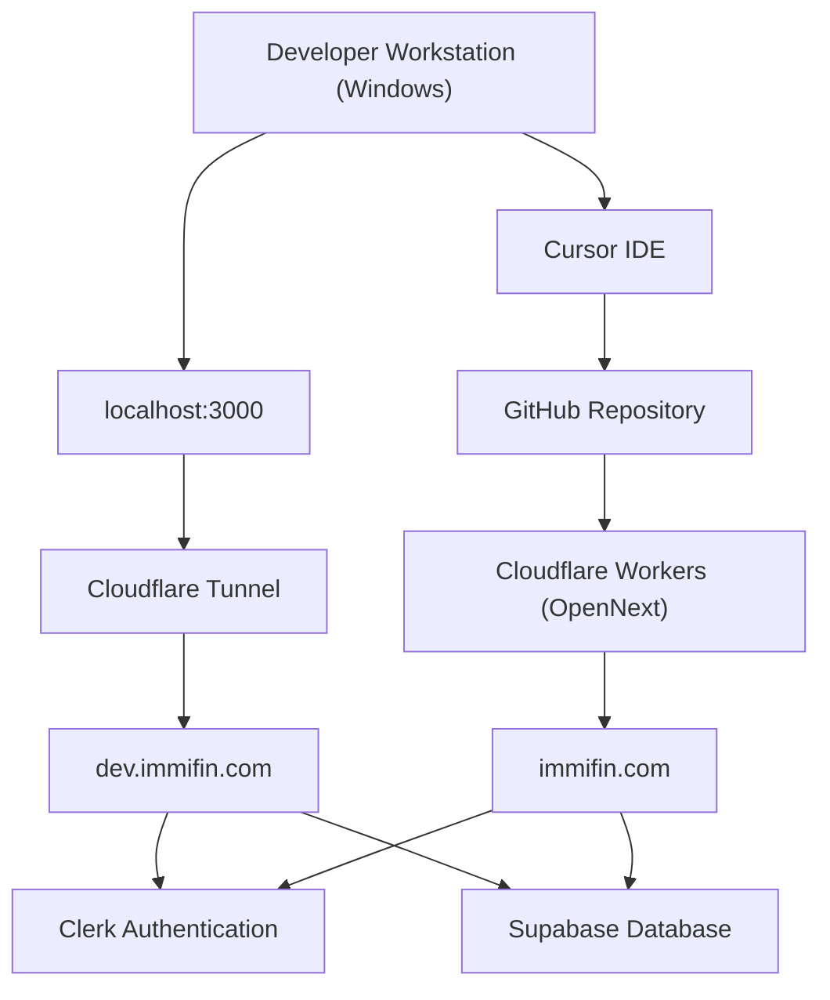
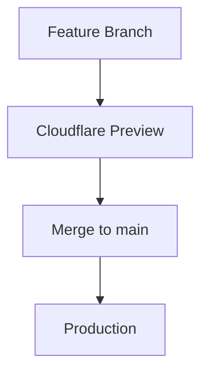

# IMMIFIN System Architecture

## 1. Document Information

| Field | Value |
|-------|-------|
| **Title** | IMMIFIN System Architecture |
| **Purpose** | This document describes the complete infrastructure architecture of the Immifin platform. |
| **Last Updated** | 2026-07-05 |
| **Owner** | Technical Architecture (CTO) |

This document is the **single source of truth** for Immifin's infrastructure, environments, deployment flow, networking, external services, and operational architecture.

It documents:

- Development environment
- Preview environment
- Production environment
- Deployment flow
- External services
- Environment variables
- Networking
- Disaster recovery

---

## 2. Source of Truth

This document is the **authoritative infrastructure reference** for the Immifin platform.

When any of the following change, this file must be updated **before or as part of** the change:

- Domains or DNS (`immifin.com`, `dev.immifin.com`)
- Cloudflare Workers / OpenNext, Pages, or Tunnel configuration
- Deployment flow or branch strategy
- External service accounts (Clerk, Supabase, GitHub)
- Environment variable names or where they are stored
- Disaster recovery procedures

If infrastructure debugging exceeds 15 minutes, pause and update this document with findings (see [ENGINEERING_PLAYBOOK.md](./ENGINEERING_PLAYBOOK.md)). Other docs (e.g. `TECHNICAL_DECISIONS.md`) record application architecture; **this document owns infrastructure**.

---

## 3. Architecture Principles

| Principle | Meaning |
|-----------|---------|
| **Local is isolated from Production** | `localhost:3000` and `.env.local` never share production secrets or data by default. |
| **Development never impacts Production** | The Cloudflare Tunnel and local dev server do not deploy to `immifin.com`. |
| **Production requires review** | Changes reaching `main` should pass release gates before they affect live users. |
| **Secrets never go into Git** | API keys, service role keys, and webhook secrets live in `.env.local` or the Cloudflare dashboard only. |
| **Infrastructure changes require documentation** | Update this file when hosting, domains, tunnels, or env strategy changes. |
| **Prefer automation** | Favor CI/CD, preview deploys, and repeatable builds over manual dashboard steps. |
| **Separate Development, Preview, and Production** | Use distinct URLs, credentials, and Supabase/Clerk instances per environment as the platform matures. |
| **Prefer existing proven architecture** | Reuse working implementations (e.g. Movement Tracker) over introducing new patterns. |
| **Server Components for data** | Keep Server Components responsible for server-side rendering and data loading. |
| **Client Components for interaction** | Keep Client Components responsible only for user interaction (toggles, local state). |
| **Deployment independent from features** | Keep deployment configuration independent from application features. |
| **Separate infra and feature work** | Never mix infrastructure work with feature work in the same sprint unless necessary. |

---

## 4. High-Level Architecture



### Component overview

| Component | Purpose |
|-----------|---------|
| **Developer Workstation (Windows)** | Local machine where Immifin is built, tested, and run via `npm run dev` |
| **Cursor IDE** | Primary development environment for implementing approved work |
| **GitHub Repository** | Source control; `main` branch triggers production deployment |
| **Cloudflare Workers (OpenNext)** | Production hosting via `@opennextjs/cloudflare`; builds from `main` |
| **Cloudflare Tunnel** | Secure outbound tunnel exposing local dev server over HTTPS |
| **localhost:3000** | Local Next.js development server (`npm run dev`) |
| **dev.immifin.com** | Public HTTPS URL routed through the tunnel to localhost |
| **immifin.com** | Production domain served by Cloudflare Workers (OpenNext) |
| **Clerk Authentication** | Identity provider — signup, login, sessions, webhooks |
| **Supabase Database** | Application Postgres — profiles, subscriptions, audit data |

---

## 5. Environments

| Environment | Purpose | URL | Deployment Method | Status |
|-------------|---------|-----|-------------------|--------|
| **Local Development** | Day-to-day coding and local testing | `http://localhost:3000` | `npm run dev` | Active |
| **Development (Tunnel)** | HTTPS dev access, Clerk webhooks, shared testing | `https://dev.immifin.com` | Cloudflare Tunnel | Active |
| **Production** | Public live site | `https://immifin.com` | GitHub `main` → OpenNext (`npm run deploy`) | Active |
| **Preview** | Branch-based pre-production testing | *Planned* | Cloudflare Preview | Planned |

---

## 6. Development Environment

| Setting | Value |
|---------|-------|
| **Operating System** | Windows |
| **IDE** | Cursor |
| **Framework** | Next.js 15 |
| **Package Manager** | npm |
| **Development Server** | `npm run dev` |
| **Configuration File** | `.env.local` |

### Purpose of `.env.local`

Stores local development secrets and environment variables. This file is **gitignored** and must never be committed. Copy variable names from `.env.example` when setting up a new workstation.

---

## 7. Cloudflare Tunnel

| Setting | Value |
|---------|-------|
| **Tunnel Name** | `immifin-dev` |
| **Purpose** | Expose localhost securely during development |
| **Public URL** | `https://dev.immifin.com` |
| **Authentication** | `cloudflared tunnel login` |
| **Certificate Location** | `C:\Users\Admin\.cloudflared\cert.pem` |

### Useful Commands

```bash
cloudflared tunnel list
cloudflared tunnel info immifin-dev
cloudflared tunnel run immifin-dev
```

### Important constraint

The Cloudflare Tunnel is intended **only for development access**. It routes `dev.immifin.com` to `http://localhost:3000` on the developer workstation. It must **not** be used as the production deployment mechanism. Production is served exclusively through **Cloudflare Workers (OpenNext)**.

Both `npm run dev` and `cloudflared tunnel run immifin-dev` must be running for `dev.immifin.com` to respond.

---

## 8. Production Deployment

| Setting | Value |
|---------|-------|
| **Current production domain** | `https://immifin.com` |
| **Deployment source** | GitHub `main` branch |
| **Hosting platform** | Cloudflare Workers via OpenNext |
| **Latest production commit** | `5f40203` — Subscription Foundation + Cloudflare build variable rebuild |
| **Production build command** | `npm run deploy` |
| **Production deploy command** | `echo done` |

### OpenNext vs plain Next.js build

| Command | Purpose |
|---------|---------|
| `npm run build` | Next.js only (`next build`) — **not** sufficient for Cloudflare Workers |
| `opennextjs-cloudflare build` | Next.js + Worker bundle (output in `.open-next/`) |
| `npm run deploy` | OpenNext build + deploy to Cloudflare |

Cloudflare’s dashboard runs **`npm run deploy`** as the build command. Deploy is already included in that script, so the separate deploy command is **`echo done`** to avoid double deployment.

### Repository config files

| File | Purpose |
|------|---------|
| `open-next.config.ts` | OpenNext Cloudflare adapter config |
| `wrangler.jsonc` | Worker bindings, compatibility flags, public vars |

Production secrets are configured in the **Cloudflare Dashboard** or via **Wrangler Version Secrets** — never in Git. See [DEPLOYMENT.md](./DEPLOYMENT.md).

---

## 9. External Services

| Service | Purpose | Current Role | Status |
|---------|---------|--------------|--------|
| **GitHub** | Source control and deploy trigger | Hosts `adminjodiba/immifin`; push to `main` deploys production | Active |
| **Cloudflare Workers (OpenNext)** | Production hosting | Builds and serves `immifin.com` via Worker | Active |
| **Cloudflare Tunnel** | Dev HTTPS access | Routes `dev.immifin.com` → localhost | Active |
| **Clerk** | Authentication and identity | Signup, login, sessions, webhook sync to Supabase | Active |
| **Supabase** | Application database | Profiles, immigration data, subscriptions, audit log | Active |

---

## 10. Environment Variables

**Production secrets must never be committed to Git.**

Manage production secrets with **Wrangler Version Secrets**:

```bash
npx wrangler versions secret put VARIABLE_NAME
```

Do not hardcode secrets in `wrangler.jsonc` or source code.

### Required (Production)

| Variable | Purpose | Secret |
|----------|---------|--------|
| `NEXT_PUBLIC_CLERK_PUBLISHABLE_KEY` | Clerk client key | No |
| `CLERK_SECRET_KEY` | Clerk server key | Yes |
| `CLERK_WEBHOOK_SECRET` | Webhook verification | Yes |
| `NEXT_PUBLIC_SUPABASE_URL` | Supabase project URL | No |
| `SUPABASE_SERVICE_ROLE_KEY` | Supabase service role | Yes |
| `GOOGLE_SHEET_ID` | Google Spreadsheet ID (admin archive) | No |
| `GOOGLE_CLIENT_EMAIL` | Service account email | Semi-secret |
| `GOOGLE_PRIVATE_KEY` | Service account private key | Yes |

### Optional

| Variable | Purpose | Default |
|----------|---------|---------|
| `NEXT_PUBLIC_CLERK_SIGN_IN_URL` | Clerk sign-in path | `/login` |
| `NEXT_PUBLIC_CLERK_SIGN_UP_URL` | Clerk sign-up path | `/signup` |
| `VISA_BULLETIN_PUBLISH_BASE` | CSV publish URL override | In `lib/visaBulletinConfig.ts` |
| `VISA_BULLETIN_GID_*` | Sheet tab GID overrides | In `lib/visaBulletinConfig.ts` |
| `VISA_BULLETIN_HISTORY_SHEET` | Archive tab name | `VisaBulletinHistory` |

Public Clerk URL defaults are also set in `wrangler.jsonc` under `vars`.

### Local Development (`.env.local`)

Copy from `.env.example`. Gitignored. Used by `npm run dev`.

### Local Workers preview (`.dev.vars`)

Gitignored. Used by `npm run preview` with Wrangler.

---

## 11. Deployment Strategy

### Current (2026-06-27)

```
Developer
        ↓
localhost:3000 (npm run dev)
        ↓ optional
dev.immifin.com (Cloudflare Tunnel)
        ↓
git add → commit → push main
        ↓
Cloudflare Workers (npm run deploy / OpenNext)
        ↓
immifin.com
```

### Future (target)

```
Feature Branch
        ↓
Cloudflare Preview
        ↓
Testing
        ↓
Merge to main
        ↓
Production
```

### Target deployment flow



### Why preview deployments reduce production risk

Preview deployments allow each feature branch to run in an isolated hosted environment before merging to `main`. This enables:

- Testing auth, API routes, and data sync without affecting live users
- Catching build failures and missing environment variables before production
- Manual acceptance on a stable URL instead of a developer's local tunnel
- Reducing the blast radius of a bad merge to `main`, which today auto-deploys to `immifin.com`

---

## 12. Disaster Recovery

### GitHub repository recovery

- The GitHub repository is the source of truth for application code.
- Clone from `adminjodiba/immifin` to restore the codebase.
- Database schema is recoverable from `supabase/migrations/`.

### Cloudflare deployment rollback

1. Open **Cloudflare Dashboard → Workers & Pages → immifin → Deployments**.
2. Identify the last known good deployment.
3. Roll back or promote that deployment to restore `immifin.com`.
4. Prefer dashboard rollback over force-push to `main`.

### Tunnel recreation

1. Run `cloudflared tunnel login` on the developer workstation.
2. Verify or recreate tunnel `immifin-dev`.
3. Restore public hostname: `dev.immifin.com` → `http://localhost:3000`.
4. Confirm DNS CNAME points to the tunnel endpoint.

### Clerk recovery

- User identity and credentials are stored in Clerk.
- Re-register webhook endpoint: `https://dev.immifin.com/api/webhooks/clerk` (dev) or `https://immifin.com/api/webhooks/clerk` (prod).
- Application roles live in Supabase `profiles`; restore via webhook sync or manual SQL bootstrap.

### Supabase recovery

- Use Supabase dashboard backups and point-in-time recovery for production data.
- Re-apply migrations from `supabase/migrations/` when rebuilding a project.
- Verify connection strings and service role key after recovery.

### Environment variable restoration

- **Local:** Restore from secure backup or password manager; reference `.env.example` for variable names.
- **Production / Preview:** Re-enter values in Cloudflare Dashboard environment settings.
- **Never** recover secrets from git history — rotate any credential that may have been exposed.

---

## 13. Known Issues

- **Visa Bulletin Dashboard** shows Final Action Dates only. Movement Tracker supports both Final Action Dates and Dates for Filing; dashboard enhancement is Priority 1 for the next sprint.
- **Preview deployments are planned** but not yet the primary workflow. Development testing currently relies on the Cloudflare Tunnel.
- **Do not convert large Server Components to Client Components** for small UI changes — use small client children (see Movement Tracker pattern). Mixing server fetch code and client UI in one module caused dev instability.

---

## 14. Application Access Layer (Subscription Capabilities)

Product feature access is **capability-based**, not plan-name checks in UI.

| Layer | Location | Role |
|-------|----------|------|
| **Tiers** | `lib/subscription/tiers.ts` | `free` / `pro` / `power` (+ future Business/Enterprise) |
| **Capabilities** | `lib/subscription/capabilities.ts` | Tier→capability map; `hasCapability`, `canAccess*` |
| **Dev override** | `lib/subscription/devTier.ts` | Local development only — disabled when Dev Subscription Mode on |
| **Dev subscription mode** | `lib/subscription/devSubscriptionMode.ts` | Beta tier activation without Stripe |
| **Subscription service** | `lib/subscription/service.ts` | Read tier from Supabase profile/subscription |

Billing will later assign a tier. Application code consumes capabilities. See [BUSINESS_MODEL.md §12](./BUSINESS_MODEL.md#12-subscription-capability-architecture).

### Premium feature gating components

| Component | Path | Role |
|-----------|------|------|
| `PremiumFeaturePreview` | `components/common/PremiumFeaturePreview.tsx` | Full-page premium preview — live page + blur overlay + upgrade CTA; optional close-to-info |
| `ProFeatureGate` | `components/subscription/ProFeatureGate.tsx` | Capability check; renders children or `ProFeatureLockedState` |
| `ProFeatureLockedState` | `components/subscription/ProFeatureLockedState.tsx` | Shared locked messaging and upgrade CTAs |
| `DashboardAccessGate` | `components/dashboard/DashboardAccessGate.tsx` | Dashboard-specific access control |
| `useEffectiveSubscriptionTier` | `lib/hooks/useEffectiveSubscriptionTier.ts` | Effective tier for UI (includes dev override) |

**Premium Feature Discovery** is the standard Free-user UX for premium pages. See [BUSINESS_MODEL.md §15](./BUSINESS_MODEL.md#15-premium-feature-discovery) and [PRODUCT_VISION.md §20](./PRODUCT_VISION.md#20-premium-feature-discovery).

---

## 17. Subscription Architecture

Subscription access flows through a single plan field to capability checks — no parallel gating systems.

```
User
  ↓
Pricing Page / Account Panel
  ↓
Subscription Service (lib/subscription/service.ts)
  ↓
Supabase — profiles.plan + subscriptions.plan
  ↓
SubscriptionTierProvider / useEffectiveSubscriptionTier
  ↓
Feature Gates (hasCapability / canAccess*)
  ↓
Application Features
```

### Tiers

| Tier | Role |
|------|------|
| **Free** | Manual tools, public dashboards, basic calculators |
| **Pro** | Personalization, automation, saved profile, Visa Bulletin History, Movement Tracker, email alerts |
| **Power** | Everything in Pro + AI, multiple profiles, advanced intelligence |

**Source of truth:** [BUSINESS_MODEL.md](./BUSINESS_MODEL.md)

### Development Subscription Mode

Temporary beta flow until Stripe integration. Gated by `NEXT_PUBLIC_DEV_SUBSCRIPTION_MODE=true`.

| Component | Path |
|-----------|------|
| Feature flag | `lib/subscription/devSubscriptionMode.ts` |
| Plan mapping | `lib/subscription/plan.ts` |
| Persistence | `lib/supabase/profiles.ts` → `updateSubscriptionPlan()` |
| API | `app/api/account/subscription/route.ts` |
| Client state | `lib/hooks/SubscriptionTierProvider.tsx` |
| Pricing UI | `components/pricing/PricingPlans.tsx` |
| Account UI | `components/subscription/DevelopmentSubscriptionPanel.tsx` |

**Important:** The flag must be a Cloudflare **Build Variable** for production UI — see [deployment/CLOUDFLARE_DEPLOYMENT.md](./deployment/CLOUDFLARE_DEPLOYMENT.md).

### Future Stripe integration

Stripe webhooks will update the same `profiles.plan` and `subscriptions.plan` fields. Capability authorization remains unchanged. Development Subscription Mode UI is replaced by Stripe checkout.

See [architecture/ADR-007-Development-Subscription-Mode.md](./architecture/ADR-007-Development-Subscription-Mode.md).

---

## 15. Design System 2.0 (next initiative)

v0.4.1 completes the platform foundation. **Design System 2.0** is the next major initiative — unified visual language, component library, and platform-wide UI consistency.

Architecture and capability models established in v0.4.1 are preserved; Design System 2.0 is a visual and component refresh.

See [PRODUCT_VISION.md §22](./PRODUCT_VISION.md#22-design-system-20-preparation) and [RELEASE_NOTES_v0.4.1.md](./RELEASE_NOTES_v0.4.1.md).

---

## 16. Future Improvements


- [ ] Design System 2.0 (unified visual language and component library)
- [ ] Separate Development Environment
- [ ] Separate Preview Environment
- [ ] Separate Production Environment
- [ ] Separate Clerk Development Instance
- [ ] Separate Clerk Production Instance
- [ ] Separate Supabase Development Project
- [ ] Separate Supabase Production Project
- [ ] GitHub Actions
- [ ] Automated Testing
- [ ] Monitoring
- [ ] Release Tags
- [ ] Infrastructure Health Checks
- [ ] CI/CD Pipeline

---

## 16. Revision History

| Version | Date | Description |
|---------|------|-------------|
| v0.1 | 2026-06-23 | Initial architecture documentation created after Sprint 1. |
| v1.2 | 2026-06-27 | Expanded Architecture Principles; known stable configuration reference in DEPLOYMENT.md. |
| v1.3 | 2026-07-03 | Application access layer — subscription tiers and capabilities (S4-005.3). |
| v1.4 | 2026-07-04 | Premium feature gating components; Design System 2.0 reference (S4-005.15). |
| v1.5 | 2026-07-05 | Subscription Architecture; Development Subscription Mode; deployment docs (S5-ENG-004). |

---

## Related documentation

| Document | Contents |
|----------|----------|
| [DEPLOYMENT.md](./DEPLOYMENT.md) | Build commands, secrets, deployment workflow (summary) |
| [deployment/CLOUDFLARE_DEPLOYMENT.md](./deployment/CLOUDFLARE_DEPLOYMENT.md) | Full Cloudflare deployment guide |
| [deployment/DEPLOYMENT_TROUBLESHOOTING.md](./deployment/DEPLOYMENT_TROUBLESHOOTING.md) | Build variable incident |
| [architecture/ADR-007-Development-Subscription-Mode.md](./architecture/ADR-007-Development-Subscription-Mode.md) | Development Subscription Mode ADR |
| [ENGINEERING_PLAYBOOK.md](./ENGINEERING_PLAYBOOK.md) | Engineering workflow and release gates |
| [RELEASE_NOTES_v0.4.1.md](./RELEASE_NOTES_v0.4.1.md) | v0.4.1 foundation milestone release notes |
| [BUSINESS_MODEL.md](./BUSINESS_MODEL.md) | Subscription tiers, capabilities, Premium Feature Discovery |
| [PRODUCT_VISION.md](./PRODUCT_VISION.md) | Long-term product vision and Design System 2.0 scope |
| [TECHNICAL_DECISIONS.md](./TECHNICAL_DECISIONS.md) | Architecture and coding conventions |
| [auth/PHASE1.md](./auth/PHASE1.md) | Clerk, Supabase, middleware, webhooks |
| [.env.example](../.env.example) | Local environment variable template |
