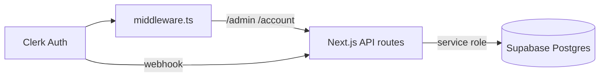

# Phase 1 Auth — Backend Foundation

Stack: Next.js App Router, Clerk, Supabase, Cloudflare Pages.

## Architecture



| System | Responsibility |
|--------|----------------|
| Clerk | Signup, login, sessions |
| `profiles` | Canonical `role`, `plan`, `status` |
| `immigration_profiles` | Immigration module extension (1:1) |
| `subscriptions` | Billing placeholder (`inactive` until Stripe) |
| `admin_audit_log` | Admin action trail |

## Clerk webhook sync

**Endpoint:** `POST /api/webhooks/clerk`

| Event | Action |
|-------|--------|
| `user.created` | `upsert_profile_from_clerk()` — creates `profiles`, triggers `immigration_profiles` + `subscriptions` |
| `user.updated` | Same upsert (email, name, avatar only) |
| `user.deleted` | `soft_delete_profile_by_clerk_id()` |

**Rules:**
- Webhooks never promote `role` to `admin`.
- Lazy upsert in `requireUser()` if webhook missed.
- Register webhook in Clerk dashboard with signing secret `CLERK_WEBHOOK_SECRET`.

## Middleware design

**File:** `middleware.ts`

| Route pattern | Behavior |
|---------------|----------|
| `/admin(.*)` | Clerk `auth.protect()` |
| `/api/admin(.*)` | Clerk `auth.protect()` |
| `/account(.*)` | Clerk `auth.protect()` |
| `/api/account(.*)` | Clerk `auth.protect()` |
| `/immigration/**` | Public |
| `/api/visa-bulletin/**` | Public |
| `/api/webhooks/clerk` | Public (Svix signature verified in route) |

Middleware checks **authentication only**. Admin **authorization** is enforced server-side via Supabase `profiles.role`.

## Admin role strategy

1. **Source of truth:** `profiles.role` in Supabase (`user` | `admin`).
2. **`requireAdmin()`:** Clerk session → load profile → `role === admin` and `status === active`.
3. **Promotion:** `set_profile_role()` SQL function (manual bootstrap or future admin API).
4. **Refresh:** role read on every admin request — no client cache, no session invalidation needed.
5. **Audit:** `admin_audit_log` on admin API success; `admin_role_changes` on role updates.

### Bootstrap first admin

After first Clerk signup and webhook sync:

```sql
select public.set_profile_role(
  p_clerk_user_id := (
    select clerk_user_id from public.profiles where email = 'founder@immifin.com' limit 1
  ),
  p_new_role := 'admin',
  p_changed_by_email := 'bootstrap@immifin.com',
  p_change_source := 'bootstrap'
);
```

## Environment variables

```env
NEXT_PUBLIC_CLERK_PUBLISHABLE_KEY=
CLERK_SECRET_KEY=
CLERK_WEBHOOK_SECRET=
NEXT_PUBLIC_CLERK_SIGN_IN_URL=/login
NEXT_PUBLIC_CLERK_SIGN_UP_URL=/signup

NEXT_PUBLIC_SUPABASE_URL=
SUPABASE_SERVICE_ROLE_KEY=
```

## Implementation order

1. Apply Supabase migrations (`001`–`008`).
2. Configure Clerk app + Cloudflare env vars.
3. Deploy webhook route; verify `user.created` creates profile rows.
4. Bootstrap admin role via SQL.
5. Verify middleware blocks unauthenticated `/api/admin/*` and `/api/account/me`.
6. Verify `requireAdmin()` returns 403 for non-admin users.
7. Build admin UI pages (deferred).
8. Add Stripe webhook + subscription sync (deferred).

## Backend files

| Path | Purpose |
|------|---------|
| `supabase/migrations/*` | Schema |
| `middleware.ts` | Route protection |
| `app/api/webhooks/clerk/route.ts` | Clerk sync |
| `app/api/account/me/route.ts` | Authenticated profile API |
| `lib/auth/requireUser.ts` | Session + profile load |
| `lib/auth/requireAdmin.ts` | Admin gate |
| `lib/clerk/profileSync.ts` | Webhook helpers |
| `lib/supabase/server.ts` | Service-role client |
| `lib/supabase/profiles.ts` | Profile queries |
| `lib/supabase/audit.ts` | Admin audit writes |
